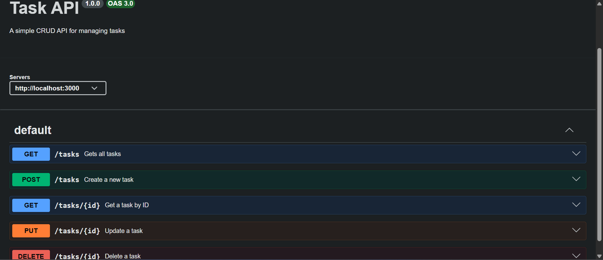

# Task API

A simple CRUD REST API built with **Node.js**, **Express.js**, and **Swagger UI**. This project demonstrates the basic CRUD (Create, Read, Update, Delete) operations for managing tasks and provides interactive API documentation using OpenAPI.

## Features

- Create a task
- View all tasks
- View a task by ID
- Update a task
- Delete a task
- Interactive API documentation with Swagger UI

---

## Prerequisites

Before running this project, make sure you have:

- Node.js installed
- npm installed

---

## Installation

1. Clone the repository:

```bash
git clone https://github.com/Kibetkipsang/flyrank-crud.git
```

2. Navigate into the project:

```bash
cd flyrank-crud
```

3. Install dependencies:

```bash
npm install
```

4. Start the server:

```bash
node server.js
```

The server will start on:

```
http://localhost:3000
```

Swagger UI is available at:

```
http://localhost:3000/docs
```

---

## API Endpoints

| Method | Endpoint | Description |
|--------|----------|-------------|
| GET | `/` | API information |
| GET | `/health` | Health check |
| GET | `/tasks` | Get all tasks |
| GET | `/tasks/:id` | Get a single task by ID |
| POST | `/tasks` | Create a new task |
| PUT | `/tasks/:id` | Update a task |
| DELETE | `/tasks/:id` | Delete a task |

---

## Example Request

```bash
curl -i http://localhost:3000/tasks
```

### Example Response

```http
HTTP/1.1 200 OK
Content-Type: application/json; charset=utf-8

[
  {
    "id": 1,
    "title": "Learn Express",
    "done": false
  },
  {
    "id": 2,
    "title": "Build todo API",
    "done": false
  },
  {
    "id": 3,
    "title": "Learn CRUD",
    "done": true
  }
]
```

---

## Swagger UI

Open the interactive documentation at:

```
http://localhost:3000/docs
```

Add your screenshot below:

```markdown

```

---

## Technologies Used

- Node.js
- Express.js
- Swagger UI Express
- OpenAPI 3.0
- JavaScript

---


---

## Author

Developed as part of a backend learning project on building REST APIs with Express.js and documenting them using Swagger UI.
